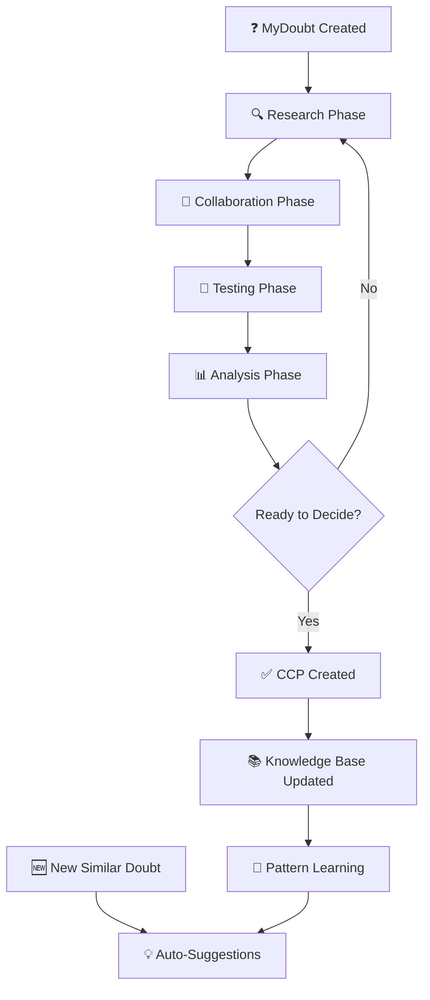

# EDT + MyTrues: Revolução no Conhecimento

## 🎯 Visão Central


### EDT (Experiential Decision Theory)
**A Filosofia**: Paradigma que prioriza a **experiência cognitiva** sobre o **conhecimento consolidado**


### MyTrues Protocol
**O Mecanismo**: Implementação técnica que torna o EDT possível na prática

---

## 🧠 O Problema Fundamental Atual


### Modelo Tradicional (Estático)
```text
Experiência Humana → Consolidação Manual → Documentação → IA Training
     (perdida)         (filtrada)         (cristalizada)    (limitada)
```text


### Modelo EDT + MyTrues (Dinâmico)
```text
CCP Raw → Refinement → Knowledge Graph → Real-Time Analysis → Dynamic Consolidation
  ↓           ↓             ↓                ↓                     ↓
Captura    Processa     Conecta         Analisa              Produz
```text

---

## 🚀 EDT como Padrão Universal


### Filosofia EDT

- **Experiência > Consolidação**: O processo cognitivo é mais valioso que o resultado

- **Temporal Awareness**: Conhecimento evolui no tempo, não é estático

- **Context Preservation**: Manter o contexto original das decisões

- **Failure Learning**: Aprender tanto com sucessos quanto com falhas


### MyTrues como Implementação

- **CCP Capture**: Mecanismo para capturar trajetórias cognitivas completas

- **Refinement Engine**: Processar experiência bruta em conhecimento utilizável

- **Dynamic Generation**: Produzir consolidação em tempo real

- **Federated Network**: Permitir troca de experiências entre organizações

---

## 🔄 Conhecimento Dinamicamente Produzido


### Em Tempo Real
```python
# Cenário: Desenvolvedor busca "Como implementar autenticação?"

# EDT/MyTrues Response:
ccp_analysis = mytrues.analyze_ccp_patterns(
    query="authentication implementation",
    context=["startup", "web app", "node.js"],
    include_failures=True,
    real_time=True
)

# Resultado dinâmico baseado em experiências recentes:
"""
📊 Análise de 47 CCPs similares (últimas 2 semanas):

- 73% começaram com OAuth → 12% falharam por complexidade

- 89% que tentaram Firebase primeiro → 45% migraram depois

- Auth0: 94% sucesso em startups < 50 devs

- Custom JWT: 67% problemas de segurança

🎯 Recomendação dinâmica:
Para seu contexto (startup, Node.js), inicie com Auth0.
Base: 23 experiências similares bem-sucedidas.
"""
```text


### Consolidação Inteligente
O "documento final" não existe mais - existe **análise contextual em tempo real**:


- **Query-Specific**: Consolidação específica para cada pergunta

- **Context-Aware**: Considerando situação atual do solicitante

- **Temporally-Relevant**: Priorizando experiências recentes

- **Failure-Informed**: Incluindo padrões de falha para evitar

---

## 🌍 EDT como Alternativa Robusta


### Comparação de Paradigmas

| Aspecto | Modelo Atual | EDT + MyTrues |
|---------|--------------|---------------|
| **Fonte** | Documentação estática | Experiência viva |
| **Temporalidade** | Snapshot fixo | Evolução contínua |
| **Contexto** | Genérico | Situação específica |
| **Falhas** | Omitidas | Aprendizado central |
| **Atualização** | Manual/lenta | Automática/real-time |
| **Personalização** | Impossível | CCP-driven |


### Vantagens Competitivas


#### 1. **Conhecimento Vivo**


- Documentação que **evolui automaticamente**

- Padrões que **emergem da experiência coletiva**

- Alertas de **práticas obsoletas** em tempo real


#### 2. **Contextualização Inteligente**


- Recomendações baseadas em **contexto similar**

- Evitar **armadilhas já conhecidas**

- Caminhos **otimizados por experiência real**


#### 3. **Aprendizado Acelerado**


- **Onboarding** baseado em trajetórias reais

- **Decisões** informadas por experiência coletiva

- **Inovação** através de cross-pollination de CCPs

---

## 🛠️ Implementação Técnica


### Arquitetura EDT/MyTrues

```mermaid
graph TB
    A[Experiência Humana] --> B[CCP Capture]
    B --> C[Raw Truth Storage]
    C --> D[Refinement Engine]
    D --> E[Knowledge Graph]
    E --> F[Real-time Analysis]
    F --> G[Dynamic Consolidation]
    G --> H[Contextual Response]

    I[Query Context] --> F
    J[Historical Patterns] --> F
    K[Failure Database] --> F
```text


### Componentes Chave


#### 1. **CCP Engine**

```typescript
interface CCP {
  context: string;        // Por que esta decisão foi necessária?
  attempts: Attempt[];    // Que caminhos foram tentados?
  failures: Failure[];    // O que não funcionou e por quê?
  success: Solution;      // O que finalmente funcionou?
  refinement: Learning[]; // Que aprendizados emergiram?
  evolution: Update[];    // Como evoluiu ao longo do tempo?
}
```text


#### 2. **Dynamic Consolidator**

```python
class EDTConsolidator:
    def generate_knowledge(self, query, context):
        # Não retorna documento estático
        # Analisa CCPs em tempo real e produz resposta contextual

        relevant_ccps = self.find_similar_ccps(query, context)
        patterns = self.extract_patterns(relevant_ccps)
        failures = self.analyze_failures(relevant_ccps)

        return self.synthesize_dynamic_response(patterns, failures, context)
```text


#### 3. **Federated Learning**

```bash
# Organizações compartilham CCPs anonimizados
./MyTrues.sh federate --share=patterns --anonymize=full
# Recebem conhecimento coletivo em troca
./MyTrues.sh sync --global-patterns --filter-by-context
```text

---

## 🎯 Roadmap para Tornar EDT Padrão


### Fase 1: Prova de Conceito (3 meses)

- [ ] Implementar CCP capture completo no MyTrues

- [ ] Desenvolver refinement engine básico

- [ ] Demonstrar consolidação dinâmica em casos reais

- [ ] Métricas de eficácia vs. documentação tradicional


### Fase 2: Validação Científica (6 meses)

- [ ] Publicar paper sobre EDT como paradigma

- [ ] Experimentos comparativos com métodos tradicionais

- [ ] Parcerias acadêmicas para validação

- [ ] Casos de uso em diferentes domínios


### Fase 3: Adoção Industrial (12 meses)

- [ ] Pilotos em empresas de tecnologia

- [ ] Integração com ferramentas existentes (Slack, Notion, etc.)

- [ ] APIs públicas para desenvolvedores

- [ ] Marketplace de experiências


### Fase 4: Padrão Global (24 meses)

- [ ] Protocolo aberto MTP (MyTrues Protocol)

- [ ] Federação entre organizações

- [ ] Integração nativa em IDEs e plataformas

- [ ] Reconhecimento como padrão de indústria

---

## 💡 Casos de Uso Transformadores


### 1. **Desenvolvimento de Software**
```text
Pergunta: "Como escalar banco de dados para 1M usuários?"
EDT Response: Análise de 156 CCPs similares mostra:

- 67% começaram com scaling vertical → 89% migraram para horizontal

- PostgreSQL + Read Replicas: sucesso em 73% casos similares

- Evitar: Sharding prematuro (42% overhead desnecessário)

- Timeline típica: 3-6 meses para implementação
```text


### 2. **Estratégia de Negócios**
```text
Pergunta: "Pricing strategy para SaaS B2B?"
EDT Response: Baseado em 89 experiências de startups similares:

- Freemium: 34% conversão média, 6 meses para break-even

- Free trial: 67% conversão, 3 meses para break-even

- Padrão emergente: $29/$79/$199 (sweet spot em experiências recentes)
```text


### 3. **Arquitetura de Sistemas**
```text
Pergunta: "Microservices ou monolith para time de 15 devs?"
EDT Response: CCPs mostram padrão claro:

- 91% que começaram microservices com <20 devs → sofreram com complexidade

- Monolith primeiro: 78% transição bem-sucedida aos 40-50 devs

- Sinal para migração: deploys >30min, >3 teams tocando mesmo código
```text

---

## 🧠 Rede Neural de Verdades (Truth Neural Network)


### Neurônios Digitais = Verdades + Experiência Histórica

Cada verdade não existe isoladamente - ela é um **neurônio digital** conectado a outras verdades através de **sinapses experienciais**.

```mermaid
graph LR
    A[Truth A: Auth Strategy] -->|causal| B[Truth B: Security Incident]
    B -->|motivational| C[Truth C: Code Review Process]
    C -->|temporal| D[Truth D: Team Guidelines]
    A -->|contextual| D
    B -->|learning| E[Truth E: Incident Response]

    F[Historical Pattern] -.->|weight| A
    G[Failure Memory] -.->|inhibition| B
    H[Success Echo] -.->|amplification| C
```text


### Tipos de Conexões (Sinapses)


#### 1. **Conexão Causal**


```typescript
interface CausalConnection {
  type: 'causal';
  strength: number;    // 0.0 - 1.0
  direction: 'causes' | 'caused_by' | 'bidirectional';
  evidence: CCP[];     // CCPs que comprovam a relação
  confidence: number;  // Confiança estatística
}

// Exemplo:
{
  from: "CORE/auth-jwt-custom",
  to: "SECURITY/xss-vulnerability",
  type: "causal",
  strength: 0.89,
  direction: "causes",
  evidence: ["SEC-001", "SEC-003", "AUTH-012"],
  confidence: 0.94
}
```text


#### 2. **Conexão Motivacional**

```typescript
interface MotivationalConnection {
  type: 'motivational';
  trigger: string;     // O que motivou a conexão
  emotion: 'fear' | 'excitement' | 'frustration' | 'curiosity';
  intensity: number;   // Força da motivação
  temporal_decay: number; // Como decai com o tempo
}

// Exemplo:
{
  from: "INCIDENTS/database-outage",
  to: "MONITORING/alerting-system",
  type: "motivational",
  trigger: "3am production down",
  emotion: "fear",
  intensity: 0.95,
  temporal_decay: 0.1  // Decai lentamente
}
```text


#### 3. **Conexão Temporal**

```typescript
interface TemporalConnection {
  type: 'temporal';
  sequence: 'before' | 'after' | 'during' | 'parallel';
  time_gap: Duration;
  evolution_pattern: 'refinement' | 'replacement' | 'complement';
}

// Exemplo:
{
  from: "ARCH/monolith-start",
  to: "ARCH/microservices-migration",
  type: "temporal",
  sequence: "before",
  time_gap: "18 months",
  evolution_pattern: "replacement"
}
```text


#### 4. **Conexão Contextual**

```typescript
interface ContextualConnection {
  type: 'contextual';
  shared_context: string[];  // Contextos compartilhados
  relevance_score: number;   // Quão relevante no contexto
  cross_domain: boolean;     // Se cruza domínios diferentes
}

// Exemplo:
{
  from: "FRONTEND/state-management",
  to: "BACKEND/caching-strategy",
  type: "contextual",
  shared_context: ["performance", "user-experience", "scalability"],
  relevance_score: 0.78,
  cross_domain: true
}
```text

---

## ⚡ Sinapses Experienciais: O "Sentimento" Entre Verdades


### Pesos Sinápticos Baseados em Experiência

Cada conexão tem um **peso sináptico** que evolui baseado na experiência:

```python
class SynapticWeight:
    def __init__(self):
        self.base_strength = 0.5       # Força inicial
        self.reinforcement_count = 0   # Quantas vezes foi reforçada
        self.success_ratio = 0.0       # % de sucessos quando ativada
        self.recency_factor = 1.0      # Mais recente = mais forte
        self.emotional_charge = 0.0    # -1.0 (trauma) a +1.0 (euforia)

    def calculate_weight(self):
        return (
            self.base_strength *
            (1 + self.reinforcement_count * 0.1) *
            self.success_ratio *
            self.recency_factor *
            (1 + abs(self.emotional_charge) * 0.3)
        )
```text


### Memória Experiencial

As conexões "lembram" de experiências passadas:

```typescript
interface ExperientialMemory {
  connection_id: string;
  activation_history: Activation[];
  learning_events: LearningEvent[];
  trauma_markers: TraumaMarker[];     // Experiências negativas marcantes
  success_echoes: SuccessEcho[];      // Sucessos que reverberam
}

// Trauma Marker (inibe conexões)
interface TraumaMarker {
  event: string;                      // "database-corruption-2024"
  impact: number;                     // Quão traumático foi
  inhibition_strength: number;        // Quanto inibe a conexão
  recovery_timeline: Duration;        // Quanto tempo para "esquecer"
}

// Success Echo (amplifica conexões)
interface SuccessEcho {
  event: string;                      // "zero-downtime-migration"
  resonance: number;                  // Quão positivo foi
  amplification: number;              // Quanto amplifica conexão
  inspiration_radius: number;         // Quantas verdades afeta
}
```text

---

## 🎯 Implementação Simples e Eficiente


### 1. **Auto-Discovery de Conexões**

Em vez de definir manualmente, usar IA para descobrir:

```bash
# Comando simples para descobrir conexões
./MyTrues.sh discover-connections --auto --threshold=0.7

# Resultado:
# 🔗 Discovered 23 new connections:
# ├── CORE/auth-strategy ⟷ SECURITY/session-mgmt (causal: 0.91)
# ├── PERF/caching ⟷ USER/response-time (motivational: 0.84)
# └── DEPLOY/ci-cd ⟷ QUALITY/testing (temporal: 0.78)
```text


### 2. **Syntax Simples para Conexões Manuais**

```markdown
# Em qualquer truth, adicionar connections:

## 🔗 Connections


### → Caused by

- `INCIDENTS/auth-breach` (fear: 0.9, evidence: strong)

- `COMPLIANCE/gdpr-requirements` (pressure: 0.7)


### → Leads to

- `MONITORING/security-alerts` (relief: 0.8)

- `TRAINING/security-awareness` (learning: 0.6)


### ↔ Related

- `ARCH/zero-trust-model` (contextual: 0.85)

- `TOOLS/security-scanner` (operational: 0.72)
```text


### 3. **Navegação Neural Intuitiva**

```bash
# Navegar pela rede neural
./MyTrues.sh neural-path CORE/auth-strategy

# Output:
# 🧠 Neural path from CORE/auth-strategy:
#
# Strong connections (>0.8):
# ├─🔥 SECURITY/breach-incident (causal: 0.94, trauma: high)
# ├─⚡ MONITORING/auth-failures (motivational: 0.87, fear-driven)
# └─🌟 SUCCESS/zero-breach-year (success-echo: 0.91, inspiration)
#
# Emerging patterns:
# ├─ Teams with strong auth → 73% fewer incidents
# ├─ Trauma from breaches → over-engineering (watch for)
# └─ Success breeds confidence → sometimes overconfidence
```text


### 4. **Query Contextual Inteligente**

```bash
# Busca considerando conexões neurais
./MyTrues.sh search "performance issues" --neural-depth=2

# Não apenas busca texto, mas:
# 1. Encontra verdades sobre performance
# 2. Segue conexões causais/motivacionais
# 3. Inclui contexto emocional/experiencial
# 4. Sugere caminhos baseados em sucesso/trauma
```text

---

## 🌟 **Bootstrap Knowledge: Uma Dimensão Especial do EDT**

### O Paradoxo do Conhecimento Bootstrap

Dentro do protocolo MyTrues, existe uma categoria especial de conhecimento: o **Bootstrap Knowledge** - conhecimento registrado retroativamente numa ferramenta que não existia quando o conhecimento foi originalmente gerado.

#### Características Fundamentais

1. **Retroatividade Temporal**
   - Conhecimento pré-existe a ferramenta de registro
   - Gap temporal entre ocorrência e documentação
   - Reconstrução baseada em memória/evidência

2. **Auto-Referência Sistêmica**
   - Ferramenta documenta própria criação/evolução
   - Meta-conhecimento sobre o próprio protocolo
   - Validação através do uso (self-validation)

3. **Incompletude Inerente**
   - Impossível capturar 100% da experiência original
   - Filtros de memória e reconstrução
   - Diferentes níveis de confidence baseados na fonte

#### Relevância para o Protocolo EDT

**Por que Bootstrap Flag é Fundamental:**

##### 1. **Integridade Temporal**
```typescript
interface TemporalIntegrity {
  occurrence_date: Date;     // Quando realmente aconteceu
  registration_date: Date;   // Quando foi registrado
  temporal_gap: Duration;    // Diferença temporal
  decay_factor: number;      // Perda de informação por tempo
}
```

##### 2. **Validação Diferenciada**
- **Conhecimento Normal**: Validado por experiência contemporânea
- **Bootstrap Knowledge**: Validado por reconstrução e evidência histórica
- **Algoritmos Específicos**: Para análise de padrões bootstrap vs. real-time

##### 3. **Meta-Análise Evolutiva**
```bash
# Análise de como protocolos evoluem
./MyTrues.sh analyze-evolution --include-bootstrap --show-emergence-patterns

# Padrões de reconstrução cognitiva
./MyTrues.sh bootstrap-analysis --confidence-threshold=0.8
```

##### 4. **Arqueologia Cognitiva**
Bootstrap knowledge permite estudar:
- Como conceitos emergem e evoluem
- Padrões de reconstrução de memória
- Diferenças entre conhecimento "vivido" vs. "reconstituído"
- Meta-aprendizado sobre formação de protocolos

#### Implementação Prática

##### Metadata Bootstrap Obrigatório
```json
{
  "is_bootstrap": true,
  "bootstrap_metadata": {
    "actual_occurrence": "2025-06-22T10:00:00Z",
    "registration_date": "2025-06-22T18:30:00Z",
    "temporal_gap": "8.5 hours",
    "reconstruction_method": "collaborative-memory",
    "evidence_sources": ["conversation-log", "document-evolution", "commit-history"],
    "confidence_level": 0.92,
    "completeness_estimate": 0.85,
    "validation_method": "cross-reference"
  }
}
```

##### Comandos CLI Específicos
```bash
# Criar truth bootstrap
./MyTrues.sh create CORE/concept --bootstrap \
  --occurrence-date="2025-06-22T10:00" \
  --confidence=0.9 \
  --evidence="conversation-log"

# Filtrar por tipo
./MyTrues.sh list --bootstrap-only
./MyTrues.sh list --exclude-bootstrap

# Análise temporal
./MyTrues.sh temporal-analysis --show-bootstrap-gaps
```

### Meta-Insight

**O fato de estarmos definindo Bootstrap Knowledge dentro do próprio MyTrues é, em si, um exemplo de meta-bootstrap**: estamos criando o conceito que explica como estamos criando o conceito.

Esta recursividade não é um bug - é uma **feature fundamental** de sistemas de conhecimento maduros: a capacidade de refletir sobre e documentar sua própria evolução.

---

## 🔄 **Semantic Versioning para Mudanças Cognitivas**

### O Conceito: Versionamento da Evolução de Pensamento

Assim como código tem versionamento semântico (MAJOR.MINOR.PATCH), **mudanças cognitivas** também podem ser versionadas semanticamente, revelando metadados preciosos sobre **certeza**, **disrupção** e **motivação** da mudança.

### Esquema de Versionamento Cognitivo

#### **MAJOR** - Mudança Disruptiva (X.0.0)

**Características:**
- Abandono completo da abordagem anterior
- Alta certeza na nova direção (>80%)
- Mudança de paradigma fundamental
- Impacto em múltiplas áreas do conhecimento

**Exemplos:**
- npm → pnpm (tooling revolution)
- Monolith → Microservices (architectural shift)  
- Waterfall → Agile (methodology paradigm)
- SQL → NoSQL (data model revolution)

#### **MINOR** - Evolução com Dúvida (0.X.0)  

**Características:**
- Mudança significativa mas com reservas
- Certeza moderada (40-80%)
- Mantém alguns aspectos da abordagem anterior
- "Experimentação cautelosa"

**Exemplos:**
- JavaScript → TypeScript (gradual adoption)
- REST → GraphQL (exploratory migration)
- MySQL → PostgreSQL (database evolution)
- Manual testing → Semi-automated (hybrid approach)

#### **HOTFIX** - Correção/Refinamento (0.0.X)

**Características:**
- Ajuste na mesma linha de pensamento
- Alta certeza na correção (>90%)
- Não muda paradigma fundamental
- "Afinação" de ideia existente

**Exemplos:**
- React 17 → React 18 (version upgrade)
- Configuração específica de ferramenta
- Ajuste de processo existente
- Bug fix conceitual

### Metadata Enriquecida de Mudança

#### Estrutura de Versionamento Cognitivo
```typescript
interface CognitiveVersioning {
  version: string;                    // "2.1.3"
  change_type: 'MAJOR' | 'MINOR' | 'HOTFIX';
  
  confidence_metrics: {
    certainty_level: number;          // 0.0-1.0
    conviction_strength: number;      // Quão forte é a convicção
    doubt_factors: string[];          // Que dúvidas ainda existem
    evidence_quality: number;         // Qualidade da evidência
  };
  
  disruption_analysis: {
    paradigm_shift: boolean;          // Muda paradigma?
    impact_radius: number;            // Quantas áreas afeta (0-10)
    legacy_preservation: number;      // Quanto mantém do anterior
    rollback_feasibility: number;    // Facilidade de voltar atrás
  };
  
  motivation_engine: {
    primary_driver: ChangeDriver;     // Principal motivador
    emotional_charge: number;         // -1.0 (medo) a +1.0 (entusiasmo)
    external_pressure: number;        // Pressão externa vs. interna
    timing_factor: 'reactive' | 'proactive' | 'forced';
  };
  
  ai_analysis: {
    change_reason_semantic: string;   // IA explica o "porquê"
    pattern_classification: string;   // Tipo de mudança identificado
    similar_cases: SimilarCase[];     // Casos similares históricos
    success_probability: number;      // Chance de sucesso baseada em padrões
  };
}
```

### Comandos CLI para Versionamento Cognitivo

```bash
# Criar mudança com versionamento automático
mytrues evolve CORE/build-system --from=npm --to=pnpm
# Análise automática sugere: MAJOR 3.0.0

# Versionamento manual com justificativa
mytrues version CORE/build-system --type=MAJOR --certainty=0.95 \
  --reason="Performance critical, high confidence"

# Análise de padrões de mudança
mytrues analyze-change-patterns --author=user --timeframe=6months
# Mostra: 34% MAJOR, 45% MINOR, 21% HOTFIX

# Comparação de certeza ao longo do tempo  
mytrues confidence-evolution CORE/auth-strategy
# Gráfico: certeza aumentando de 0.6 → 0.9 ao longo de 3 versões

# Predição de sucesso baseada em padrões
mytrues predict-success "monolith→microservices" --context=team-size:15
# Output: 67% success probability, similar to 23 historical cases
```

### Valor da Informação de Certeza

#### Para Indivíduos
- **Auto-Conhecimento**: Entender próprios padrões de certeza/dúvida
- **Timing Otimizado**: Saber quando está "maduro" para mudança MAJOR
- **Gestão de Risco**: Identificar quando confiança está baixa demais

#### Para Equipes  
- **Alinhamento**: Sincronizar níveis de certeza em decisões
- **Mentoria**: Identificar membros com baixa confiança para suporte
- **Consenso**: Aguardar convergência de certeza antes de MAJOR changes

#### Para Organizações
- **Risk Management**: Evitar mudanças MAJOR com baixa certeza coletiva
- **Innovation Metrics**: Balancear inovação (MAJOR) vs. estabilidade (HOTFIX)
- **Learning Analytics**: Identificar áreas com alta incerteza crônica

### Meta-Insight: Transparência da Incerteza

**O versionamento cognitivo com metadata de certeza torna explícito algo que normalmente fica obscuro**: o nível de convicção por trás das decisões.

Esta transparência permite:
- **Decisões mais informadas** (saber quando outros duvidaram)
- **Aprendizado acelerado** (entender o "porquê" das mudanças)
- **Gestão de risco** (evitar repetir mudanças com baixa certeza)
- **Evolução consciente** (reconhecer padrões próprios de mudança)

---

## 🧠 **MyTrues como Assistente de Memória Experiencial**

### O Problema: Conversas de IA Perdidas no Tempo

**Situação Atual:**
- Milhares de conversas com IA fragmentadas
- Insights valiosos perdidos em chats antigos
- Repetição constante de contexto para IA
- Conhecimento não acumula entre sessões
- Zero aprendizado persistente das preferências/padrões

### Solução MyTrues: Memory-Aware AI Assistant

Integração via **MCP (Model Context Protocol)** que transforma cada conversa em **aprendizado acumulativo permanente**.

#### Auto-Detection de Novas Verdades

```typescript
interface AutoTruthDetection {
  conversation_analysis: {
    new_insights: InsightCandidate[];
    decision_patterns: DecisionPattern[];
    preference_evolution: PreferenceChange[];
    problem_solving_approaches: Approach[];
  };
  
  auto_ccp_triggers: {
    explicit_decisions: "Decidimos usar X porque Y";
    learned_lessons: "Aprendi que Z não funciona quando W";
    pattern_recognition: "Sempre que A acontece, faço B";
    failure_reports: "X falhou por causa de Y";
  };
  
  confidence_thresholds: {
    auto_create: 0.85;      // Cria CCP automaticamente
    suggest_creation: 0.70;  // Sugere ao usuário
    flag_for_review: 0.50;   // Marca para revisão posterior
  };
}
```

#### Memory Assistant Features

Durante conversa com IA, MyTrues intervém automaticamente:

**Exemplo 1 - Prevenção de Repetição:**
```text
User: "Como implementar autenticação JWT?"

AI + MyTrues: 
"🧠 Lembro que você já pesquisou isso em março/2024 e decidiu 
usar Auth0 porque 'custom JWT dá muito trabalho de segurança'.

Sua conclusão na época: 'Para startups <50 devs, Auth0 vale a pena'

Quer que eu recupere suas notas ou prefere repensar a abordagem?"
```

**Exemplo 2 - Aprendizado com Falhas:**
```text
User: "Vou fazer deploy direto na sexta"

MyTrues-Enhanced AI:
"🚨 Alerta experiencial!

Histórico de deploys sexta:
├─ 2024-03-15: Deploy sexta → bug crítico → weekend fix
├─ 2024-07-12: Deploy sexta → rollback → stress 
├─ 2024-11-08: Deploy sexta → sem problemas (exceção)

Seu padrão: 67% dos deploys sexta geram problemas.
Sua regra atual: 'Nunca deploy sexta, só emergência'

Confirma que é emergência ou agenda para segunda?"
```

### Auto-Evolution de System Prompts

#### Geração Dinâmica de Contexto

```typescript
interface DynamicSystemPrompt {
  user_cognitive_profile: {
    decision_patterns: DecisionPattern[];
    risk_tolerance: number;
    preferred_communication: CommunicationStyle;
    learning_style: LearningStyle;
    expertise_areas: ExpertiseArea[];
  };
  
  contextual_memories: {
    recent_decisions: RecentDecision[];
    active_projects: Project[];
    current_challenges: Challenge[];
    evolving_preferences: PreferenceEvolution[];
  };
  
  interaction_optimization: {
    response_length: 'concise' | 'detailed' | 'adaptive';
    technical_depth: number;
    example_preference: 'practical' | 'theoretical' | 'mixed';
    feedback_style: 'direct' | 'suggestive' | 'collaborative';
  };
}
```

### Valor Exponencial da Memória Acumulativa

#### **Para Indivíduos**
- **Zero Context Switching**: IA sempre "lembra" do contexto completo
- **Consistent Learning**: Conhecimento se acumula entre todas as sessões
- **Pattern Recognition**: Identifica padrões pessoais que você não vê
- **Decision Quality**: Decisões informadas por toda experiência histórica

#### **Para Equipes**
- **Institutional Memory**: Conhecimento da equipe persiste além das pessoas
- **Onboarding Acelerado**: Novos membros acessam experiência coletiva
- **Consistent Standards**: Padrões emergem automaticamente das decisões
- **Learning Amplification**: Sucesso/falha de um beneficia todos

### Meta-Revolução: IA que Cresce com Você

**Esta não é apenas uma feature - é uma mudança fundamental na relação humano-IA:**

De **"IA como ferramenta descartável"** para **"IA como parceiro cognitivo persistente"** que:

- **Aprende** suas preferências ao longo do tempo
- **Lembra** de suas decisões e consequências
- **Reconhece** seus padrões únicos de pensamento
- **Evolui** junto com seu crescimento pessoal/profissional
- **Antecipa** suas necessidades baseado em experiência

---

## 📋 **Template-Driven Standardization**

### O Problema da Falta de Padrão

**Situação Atual:**
- Cada pessoa documenta de forma diferente
- Formatos inconsistentes entre equipes/projetos
- Dificuldade de agregar conhecimento
- Perda de informação por falta de estrutura
- Retrabalho constante de formatação

### Solução MyTrues: Templates Dinâmicos

```bash
# Geração automática de conhecimento consolidado
mytrues templates generate --type=technical-decision
mytrues templates generate --type=project-retrospective  
mytrues templates generate --type=research-findings
mytrues templates generate --type=business-analysis

# Compliance automático com padrões
mytrues templates lint --standard=ABNT
mytrues templates lint --standard=IEEE  
mytrues templates lint --standard=ISO-9001
mytrues templates lint --standard=company-style
```

### Funcionamento dos Templates

#### 1. **Detecção Automática de Padrões**

MyTrues analisa CCPs existentes e detecta:
- Estruturas recorrentes
- Campos comuns
- Padrões de linguagem
- Metadados típicos
- Formatos preferidos

#### 2. **Geração Dinâmica de Templates**

Com base nos padrões detectados:
- Cria templates personalizados
- Sugere campos obrigatórios
- Define validações automáticas
- Estabelece estrutura hierárquica
- Configura metadados padrão

### Benefícios da Padronização Automática

#### Para Usuários Individuais
- ✅ Menos tempo formatando
- ✅ Mais tempo pensando
- ✅ Captura consistente
- ✅ Facilita revisão posterior

#### Para Equipes
- ✅ Comunicação mais clara
- ✅ Onboarding acelerado
- ✅ Conhecimento agregável
- ✅ Qualidade padronizada

#### Para Organizações
- ✅ Compliance automático
- ✅ Auditoria facilitada
- ✅ Knowledge transfer eficiente
- ✅ Analytics comparáveis

#### Para IA/Analytics
- ✅ Dados estruturados
- ✅ Análise padronizada
- ✅ Comparações válidas
- ✅ Insights mais precisos

---

## 📊 **Evolução de Pensamento e Metamudança Social**

### O Valor dos Metadados de Mudança de Opinião

O MyTrues pode capturar não apenas **o que** as pessoas pensam, mas **como** e **por que** mudaram de opinião - criando uma nova dimensão de dados comportamentais.

### Diferencial Revolucionário

**Pesquisas Tradicionais:**
```text
"O que você pensa sobre aquecimento global?"
└── Snapshot estático: 67% acreditam
```

**MyTrues CCP Analysis:**
```text
"Como sua opinião sobre aquecimento global evoluiu?"
├── Context: Evento climático extremo
├── Change: De cético para preocupado  
├── Consequence: Mudança de comportamento
├── Neural Path: Quais evidências convenceram
└── Metadata: Padrões de conversão em massa
```

### Aplicações Transformadoras para Indústrias

#### **Marketing & Persuasão**

**Traditional Approach vs EDT Approach**

```bash
# Análise de mudança de marca
./MyTrues.sh analyze-brand-evolution "Tesla" --timeframe="2020-2025"

# Output:
# 🧠 Brand Perception Evolution Analysis:
# 
# Mass Opinion Shifts Detected:
# ├─ 2020: "Luxury toy" → 2023: "Mainstream option" (34% population)
# ├─ Trigger: Model 3 price drop + Supercharger network
# └─ Conversion rate: 67% who test drove → purchased within 6 months
```

#### **Política & Democracia**

```bash
# Análise de evolução eleitoral
./MyTrues.sh political-evolution "Healthcare Policy" --region="Midwest"

# Output:
# 🗳️ Political Opinion Evolution Analysis:
#
# Healthcare Policy Sentiment (2020-2025):
# ├─ Initial: 45% pro-universal, 55% pro-private
# ├─ Current: 62% pro-universal, 38% pro-private  
#
# Key Conversion Triggers:
# ├─ Personal medical bankruptcy (89% conversion rate)
# ├─ Family member chronic illness (67% conversion rate)
# ├─ Job loss = insurance loss (78% conversion rate)
```

### Valor para Indústrias Específicas

#### **Marketing & Publicidade**

**Valor Comercial:**
- **Timing Otimizado**: Saber quando pessoas estão abertas à mudança
- **Messaging Personalizado**: Argumentos que funcionam para cada perfil
- **Influencer Identification**: Quem realmente muda opiniões (não apenas popularidade)
- **ROI Predictivo**: Probabilidade de conversão baseada em neural paths

#### **Recursos Humanos & Organizational Change**

```bash
# Corporate Change Management
./MyTrues.sh change-readiness "Remote Work Policy" --organization="TechCorp"

# Output:
# 🏢 Organizational Change Readiness:
#
# Employee segments:
# ├─ Early Adopters (23%): Ready, will advocate
# ├─ Pragmatic Majority (54%): Need proof of success
# ├─ Skeptics (18%): Require personal benefit demonstration  
# └─ Resisters (5%): May never fully adopt
```

### Potencial de Mercado

#### B2B (Empresas)
- **Marketing Agencies**: $50B+ market com precisão 10x maior
- **Management Consulting**: Gestão de mudança organizacional evidence-based
- **Market Research**: Substituir pesquisas estáticas por intelligence dinâmica

#### B2G (Governos)  
- **Policy Development**: Simular impacto de políticas antes da implementação
- **Public Communication**: Messaging otimizado por neural paths
- **Social Cohesion**: Monitorar e melhorar diálogo democrático

### Visão de Futuro: MyTrues como OS Social

#### Impacto Civilizacional

**Imagine um mundo onde:**

- **Marketing** é sobre entender genuinamente o cliente, não manipulá-lo
- **Política** é informada por evolução real de pensamento, não polls enviesadas  
- **Educação** se adapta aos padrões cognitivos únicos de cada estudante
- **Mudança Social** acontece através de understanding mútuo, não polarização
- **Democracia** funciona melhor porque entendemos como opiniões realmente se formam

**MyTrues/EDT**: De ferramenta de gestão de conhecimento para **plataforma de inteligência coletiva** que pode revolucionar como humanos colaboram, aprendem e evoluem juntos.

---
## 🌐 **A Revolução do Conhecimento Dinâmico**

### "O PHP do Pensamento Consolidado"

Assim como **PHP revolucionou** a web ao transformar sites estáticos em dinâmicos, o **MyTrues está prestes a revolucionar** a documentação ao transformar conhecimento estático em **conhecimento vivo e responsivo**.

### Analogia Histórica: Web Evolution

#### Era Estática (HTML puro)

**Sites Estáticos (1990s):**
- Conteúdo fixo e imutável
- Atualização manual e custosa  
- Mesma informação para todos
- Sem personalização
- Sem interatividade

**Documentação Atual:**
- READMEs estáticos
- Wikis desatualizadas
- PDFs obsoletos
- Informação genérica
- Zero personalização

#### Era Dinâmica (PHP + Databases)

**Sites Dinâmicos (2000s+):**
- Conteúdo gerado em tempo real
- Dados vindos de database
- Personalização por usuário
- Interatividade total
- Evolução constante

**MyTrues Knowledge (2025+):**
- Conhecimento gerado on-demand
- CCPs como database vivo
- Contextualização inteligente
- Multi-format responsive
- Evolução automática

### Visão Futura: GitHub Pages Dinâmico

#### Implementação no GitHub

```markdown
# README.md tradicional vira:

# 🧠 MyTrues Dynamic Knowledge

**Last Updated**: *Generated live on {{ timestamp }}*
**Context**: *{{ user_context }}*
**Depth Level**: *{{ depth_level }}*

<button onclick="generateKnowledge()">
🔄 Generate Fresh Knowledge
</button>

<div id="dynamic-content">
<!-- Conteúdo gerado dinamicamente baseado em:
     - CCPs mais recentes
     - Contexto do visitante  
     - Nível de detalhamento escolhido
     - Templates apropriados
-->
</div>

---
*Powered by [MyTrues Protocol](https://mytrues.io)*
*Last CCP Update: 2 hours ago*
*Knowledge Freshness: 🟢 Fresh*
```

#### GitHub Pages + MyTrues API

```javascript
// gh-pages/dynamic-readme.js
class DynamicKnowledge {
    async generateContent(options = {}) {
        const {
            depth = 'overview',        // overview | detailed | expert
            format = 'web',           // web | mobile | print | slides
            audience = 'developer',   // developer | business | technical
            language = 'pt-br'        // pt-br | en | es
        } = options;

        // Chama API do MyTrues
        const knowledge = await fetch('/api/mytrues/consolidate', {
            method: 'POST',
            body: JSON.stringify({
                project: 'mytrues-protocol',
                context: this.detectContext(),
                depth_level: depth,
                output_format: format,
                target_audience: audience,
                language: language,
                real_time: true
            })
        });

        return knowledge.json();
    }

    detectContext() {
        return {
            user_agent: navigator.userAgent,
            referrer: document.referrer,
            time_of_day: new Date().getHours(),
            device_type: this.getDeviceType(),
            previous_visits: this.getPreviousVisits()
        };
    }
}
```

### Multi-Format Responsive Knowledge

#### Template Engine Dinâmico

```bash
# Usuário acessa README no mobile
./MyTrues.sh generate-knowledge --format=mobile --depth=summary

# Usuário quer imprimir documentação
./MyTrues.sh generate-knowledge --format=print --depth=detailed --pages=A4

# Apresentação em slides
./MyTrues.sh generate-knowledge --format=slides --audience=executives

# Documentação técnica completa
./MyTrues.sh generate-knowledge --format=technical --depth=expert --include-ccps
```

#### Exemplo de Geração Contextual

**Cenário 1**: Desenvolvedor no mobile, meio-dia

```markdown
# MyTrues - Quick Overview 📱

⏱️ *2-minute read* | 🔄 *Updated 3h ago*

## What is MyTrues?
Knowledge management that captures **how** decisions were made, not just **what** was decided.

## Core Concepts
- **CCP (Context, Challenge, Path)**: The fundamental unit of experiential knowledge
- **Dynamic Consolidation**: Knowledge generated on-demand based on context
- **Neural Connections**: Truths connected like neurons in a brain

## Quick Start
```bash
npm install mytrues-cli
mytrues init
mytrues create CORE/first-decision
```

## Key Benefits
- ✅ Never lose context again
- ✅ Learn from past decisions  
- ✅ Share knowledge effectively

[📖 Full Documentation] [🚀 Try Demo]
```

**Cenário 2**: CTO no desktop, querendo detalhes técnicos

```markdown
# MyTrues Protocol: Technical Deep Dive

*Generated for: Technical Leadership*
*Estimated read time: 15 minutes*
*Last CCP update: 2 hours ago*

## Executive Summary
MyTrues implements Experiential Decision Theory (EDT) as a practical knowledge management protocol...

## Architecture Overview
[Detailed technical diagrams]

## Implementation Strategy
[Comprehensive roadmap with timelines]

## ROI Analysis
[Business metrics and projections]

## Technical Specifications
[Complete API documentation]
```

### Plataforma de Conhecimento como Serviço

#### Portal MyTrues.io

**Portal Features:**
- 🏠 Dynamic Home Page
  - Personalized content based on user profile
  - Real-time knowledge freshness indicators
  - Context-aware navigation

- 📚 Knowledge Repository
  - Multi-organization knowledge sharing
  - Privacy-controlled access levels
  - Cross-pollination recommendations

- 🔧 Template Marketplace
  - Community-contributed templates
  - Industry-specific formats
  - White-label customizations

- 📊 Analytics Dashboard
  - Knowledge evolution tracking
  - Decision impact analysis
  - Organizational learning metrics

- 🤖 AI Integration Hub
  - LLM model marketplace
  - Custom prompt engineering
  - Federated learning networks

#### API Pública para Integração

```python
# Qualquer site pode integrar conhecimento dinâmico
from mytrues import DynamicKnowledge

knowledge = DynamicKnowledge(
    api_key="your-key",
    organization="your-org"
)

# Gera conhecimento contextual para qualquer página
dynamic_content = knowledge.generate(
    topic="database-scaling",
    context={
        "user_level": "intermediate",
        "project_stage": "architecture-phase",
        "team_size": 12,
        "budget_range": "medium"
    },
    format="web-embed"
)

# Resultado: HTML otimizado para o contexto específico
```

### Casos de Uso Revolucionários

#### 1. **GitHub Repositories Inteligentes**

**Repositório de Framework:**
- README se adapta ao nível de experiência do visitante
- Exemplos de código baseados no projeto do usuário
- Troubleshooting personalizado por stack tecnológica
- Roadmap atualizado com base em CCPs da comunidade

#### 2. **Documentação Corporativa Viva**

**Wiki Empresarial:**
- Onboarding personalizado por cargo e senioridade
- Procedimentos atualizados automaticamente
- Contexto histórico de decisões disponível on-demand
- Cross-references inteligentes entre departamentos

#### 3. **Plataformas Educacionais Adaptativas**

**Material Didático:**
- Complexidade ajustada ao progresso do aluno
- Exemplos relevantes para a área de interesse
- Exercícios gerados baseados em CCPs reais
- Feedback evolutivo baseado em performance histórica

### Impacto Civilizacional

#### Fim da Era da Documentação Obsoleta

**Antes (Era Estática):**
- READMEs desatualizados em 90% dos projetos
- Wikis corporativas com informação de 2 anos atrás
- Manuais impressos obsoletos no momento da impressão
- Tempo perdido procurando informação atual
- Decisões baseadas em conhecimento defasado

**Depois (Era Dinâmica):**
- Conhecimento sempre fresh e contextualizado
- Zero esforço de manutenção manual
- Personalização automática por audiência
- Tempo focado em pensar, não em procurar
- Decisões baseadas em experiência coletiva viva

#### Democratização do Conhecimento

**Organizações de Qualquer Tamanho:**
- **Startups**: Conhecimento sophisticado desde o dia 1
- **Scale-ups**: Preservação automática da cultura/decisões
- **Enterprises**: Consolidação inteligente de silos
- **Open Source**: Comunidade auto-organizando conhecimento
- **Individual**: Personal knowledge que evolui com você

### Meta-Insight: A Nova Era do Conhecimento

**Estamos propondo uma mudança de paradigma equivalente à revolução web dinâmica**:

- **1990s**: Sites estáticos → Informação fixa
- **2000s**: Sites dinâmicos → Informação contextual  
- **2025+**: Knowledge dinâmico → **Sabedoria contextual**

**MyTrues não é apenas uma ferramenta - é a infraestrutura para a próxima era da inteligência coletiva humana.**

*"Assim como não conseguimos mais imaginar a web sem dinamismo, em breve não conseguiremos imaginar conhecimento sem contextualização inteligente."*

---

## 🤔 **MyDoubts: Gestão Inteligente de Incertezas**

### O Problema das Dúvidas Não Documentadas

**Situação Atual:**
- Dúvidas ficam perdidas em chats/emails
- Mesmas perguntas repetidas infinitamente
- Conhecimento incompleto sem contexto de incerteza
- Decisões tomadas sem documentar as hesitações
- Expertise desperdiçada em respostas isoladas

### MyDoubts: A Dimensão da Incerteza Ativa

**MyDoubts** é uma categoria especial dentro do MyTrues que captura e gerencia **questões em aberto**, **incertezas explícitas** e **conhecimento em construção**.

#### Estrutura de um MyDoubt

```typescript
interface MyDoubt {
  id: string;                        // DOUBT/database-choice-2024
  
  uncertainty: {
    question: string;                // "PostgreSQL ou MongoDB para nosso caso?"
    context: string;                 // Contexto específico da dúvida
    urgency: 'low' | 'medium' | 'high' | 'critical';
    decision_deadline: Date;         // Quando precisa decidir
    impact_level: number;           // 1-10, impacto da decisão
  };
  
  exploration: {
    research_done: ResearchItem[];   // O que já foi pesquisado
    options_considered: Option[];    // Alternativas sendo avaliadas
    experiments_running: Experiment[]; // Testes em andamento
    expert_opinions: ExpertInput[];  // Opiniões de especialistas
  };
  
  collaboration: {
    stakeholders: string[];          // Quem precisa opinar
    discussion_threads: Thread[];    // Discussões relacionadas
    polls_created: Poll[];          // Votações para decidir
    consensus_level: number;        // 0-1, nível de acordo atual
  };
  
  resolution_path: {
    current_status: 'open' | 'researching' | 'testing' | 'deciding' | 'resolved';
    next_steps: NextStep[];         // Próximos passos definidos
    blockers: Blocker[];           // O que está impedindo decisão
    success_criteria: Criteria[];   // Como saber se decidiu bem
  };
  
  evolution_to_ccp: {
    will_become_ccp: boolean;       // Se vai virar CCP quando resolver
    ccp_draft: Partial<CCP>;       // Rascunho do CCP futuro
    confidence_threshold: number;   // Qual certeza mínima para fechar
  };
}
```

### Comandos CLI para MyDoubts

#### Criação e Gestão de Dúvidas

```bash
# Criar nova dúvida
mytrues doubt create "PostgreSQL ou MongoDB?" \
  --context="E-commerce com 100k usuários" \
  --urgency=high \
  --deadline="2024-12-15" \
  --impact=8

# Listar dúvidas em aberto
mytrues doubt list --status=open --urgency=high

# Adicionar pesquisa à dúvida
mytrues doubt research DOUBT/database-choice \
  --source="benchmark PostgreSQL vs MongoDB" \
  --findings="PostgreSQL 2x faster em joins, MongoDB melhor para docs"

# Adicionar opinião de especialista
mytrues doubt expert-input DOUBT/database-choice \
  --expert="João Silva (DBA Senior)" \
  --opinion="PostgreSQL para transações, MongoDB para analytics"

# Criar poll para stakeholders
mytrues doubt poll DOUBT/database-choice \
  --question="Qual database escolher?" \
  --options="PostgreSQL,MongoDB,Hybrid" \
  --stakeholders="team-backend,team-devops"
```

#### Colaboração e Discussão

```bash
# Vincular discussão do Slack/Discord
mytrues doubt link-discussion DOUBT/database-choice \
  --platform=slack \
  --thread="https://workspace.slack.com/thread/123"

# Agendar reunião de decisão
mytrues doubt schedule-decision DOUBT/database-choice \
  --date="2024-12-10 14:00" \
  --attendees="team-backend,cto"

# Definir critérios de sucesso
mytrues doubt criteria DOUBT/database-choice \
  --success="Performance >1000 req/s, Downtime <0.1%, Team comfort >7/10"
```

#### Evolução para CCP

```bash
# Preparar transição para CCP
mytrues doubt prepare-ccp DOUBT/database-choice \
  --confidence=0.85 \
  --draft-ccp="CORE/database-final-choice"

# Fechar dúvida e criar CCP
mytrues doubt resolve DOUBT/database-choice \
  --decision="PostgreSQL chosen" \
  --create-ccp=true \
  --reasoning="Performance + team expertise + ACID compliance"
```

### Integração com Plataformas de Colaboração

#### Slack/Discord Integration

```typescript
interface SlackDoubtsBot {
  commands: {
    "/doubt-create": "Criar nova dúvida a partir de thread";
    "/doubt-vote": "Votar em opções da dúvida";
    "/doubt-expert": "Marcar alguém como expert no tópico";
    "/doubt-update": "Atualizar status da pesquisa";
    "/doubt-close": "Fechar dúvida com decisão final";
  };
  
  auto_detection: {
    uncertainty_phrases: [
      "não sei se...",
      "qual seria melhor...",
      "alguém já testou...",
      "preciso decidir entre...",
      "não tenho certeza..."
    ];
    suggest_doubt_creation: boolean;
  };
  
  notifications: {
    deadline_approaching: "🚨 Decisão sobre {doubt} vence em 2 dias";
    new_expert_input: "💡 {expert} opinou sobre {doubt}";
    consensus_reached: "✅ Consenso atingido em {doubt}: {decision}";
    research_added: "📚 Nova pesquisa adicionada a {doubt}";
  };
}
```

#### Integração com GitHub Issues/Discussions

```markdown
# GitHub Issue automaticamente criado para cada MyDoubt

## 🤔 [MyDoubt] PostgreSQL ou MongoDB para e-commerce?

**Context**: E-commerce com 100k usuários, crescimento 30% ao mês
**Urgency**: High ⚠️
**Decision Deadline**: 2024-12-15
**Impact Level**: 8/10

### Current Research
- [ ] Performance benchmark PostgreSQL vs MongoDB
- [x] Team expertise assessment (PostgreSQL: 8/10, MongoDB: 4/10)
- [ ] Cost analysis for both options
- [ ] Migration complexity evaluation

### Options Being Considered
1. **PostgreSQL** 
   - ✅ Team expertise
   - ✅ ACID compliance
   - ❌ JSON handling overhead
   
2. **MongoDB**
   - ✅ Flexible schema
   - ✅ Horizontal scaling
   - ❌ Team learning curve

### Expert Opinions
- **@joao-dba**: "PostgreSQL for transactional, MongoDB for analytics"
- **@maria-architect**: "Start PostgreSQL, evaluate MongoDB later"

### Next Steps
- [ ] Run performance tests with real data (Due: 2024-12-08)
- [ ] Interview 3 companies with similar use case (Due: 2024-12-10)
- [ ] Final team meeting (Scheduled: 2024-12-12)

---
*This issue will automatically become a CCP when resolved*
*Track in MyTrues: `mytrues doubt view DOUBT/database-choice-2024`*
```

### Casos de Uso Transformadores

#### **1. Arquitetura de Software**

```bash
# Dúvida arquitetural complexa
mytrues doubt create "Microservices ou Monolith?" \
  --context="Team 15 devs, produto B2B, alta complexidade de negócio" \
  --research-links="martinfowler.com/microservices" \
  --expert-request="@senior-architects"

# Sistema sugere automaticamente:
# - Papers relevantes sobre o tema
# - CCPs similares de outras organizações (anonymized)
# - Experts internos que já enfrentaram decisão similar
# - Timeline sugerido para experimentação
```

#### **2. Decisões de Produto**

```bash
# Product Management uncertainty
mytrues doubt create "Feature A ou Feature B primeiro?" \
  --context="Roadmap Q1, recursos limitados" \
  --stakeholders="product,engineering,sales" \
  --poll-deadline="2024-12-20"

# Automaticamente cria:
# - Poll para stakeholders votarem
# - Análise de impacto baseada em CCPs passados
# - Matriz de priorização colaborativa
# - Timeline de implementação estimado
```

### Inteligência Coletiva em MyDoubts

#### Auto-Suggestions baseadas em Padrões

```python
class DoubtIntelligence:
    def suggest_research_paths(self, doubt):
        # Analisa dúvidas similares resolvidas
        similar_doubts = self.find_similar_resolved_doubts(doubt)
        
        return {
            "research_suggestions": [
                "90% das dúvidas similares pesquisaram X",
                "Padrão comum: testar com POC antes de decidir",
                "Expert Y tem 95% accuracy em decisões similares"
            ],
            "common_pitfalls": [
                "67% subestimaram complexidade de migração",
                "Cuidado: decision paralysis comum neste tipo"
            ],
            "success_patterns": [
                "Decisões com >3 experts input: 89% success rate",
                "POCs de 2 semanas são sweet spot"
            ]
        }

    def predict_resolution_timeline(self, doubt):
        return {
            "estimated_days": 12,
            "confidence": 0.84,
            "factors": [
                "Complexidade média baseada em histórico",
                "3 stakeholders = +4 dias médio",
                "High urgency = -30% timeline"
            ]
        }
```

### Valor Diferencial dos MyDoubts

#### **Para Indivíduos**
- **Structured Uncertainty**: Dúvidas organizadas, não perdidas
- **Collaborative Learning**: Aprende com dúvidas dos outros
- **Decision Confidence**: Maior certeza através de processo estruturado
- **Knowledge Building**: Incerteza vira conhecimento documentado

#### **Para Equipes**
- **Transparent Decisions**: Todo mundo vê o processo de decisão
- **Collective Intelligence**: Sabedoria coletiva aplicada a incertezas
- **Reduced Repetition**: Dúvidas similares apontam para resoluções passadas
- **Faster Consensus**: Ferramentas estruturadas para chegar a acordo

#### **Para Organizações**
- **Institutional Learning**: Organização aprende com suas próprias dúvidas
- **Risk Mitigation**: Incertezas explícitas permitem melhor gestão de risco
- **Innovation Acceleration**: Dúvidas estruturadas facilitam experimentação
- **Knowledge Retention**: Processo de dúvida → pesquisa → decisão preservado

### Integração com CCPs: O Ciclo Completo

#### MyDoubt → CCP Evolution



### Meta-Evolução: Da Incerteza ao Conhecimento

**MyDoubts transforma o processo natural de questionamento em infraestrutura de aprendizado organizacional:**

1. **Captura**: Incertezas não se perdem mais
2. **Estrutura**: Dúvidas ganham contexto e processo
3. **Colabora**: Inteligência coletiva aplicada a incertezas
4. **Evolui**: Incerteza estruturada vira conhecimento consolidado
5. **Aprende**: Padrões emergem para otimizar futuras decisões

### Impacto na Cultura Organizacional

#### **Antes: Cultura da Certeza Falsa**

**Problemas Atuais:**
- Dúvidas são vistas como fraqueza
- Decisões precipitadas por pressão
- Incertezas escondidas até virarem crises
- Conhecimento não compartilhado por insegurança
- Repetição de erros por falta de transparência

#### **Depois: Cultura da Incerteza Produtiva**

**Nova Cultura:**
- Dúvidas são vistas como oportunidade de aprendizado
- Decisões estruturadas com transparência de processo
- Incertezas explícitas permitem gestão proativa
- Conhecimento cresce através da colaboração em dúvidas
- Erros prevenidos através de padrões de incerteza

**MyDoubts não apenas gerencia dúvidas - transforma a relação organizacional com a incerteza, criando uma cultura onde não saber é o primeiro passo para aprender coletivamente.**

---
